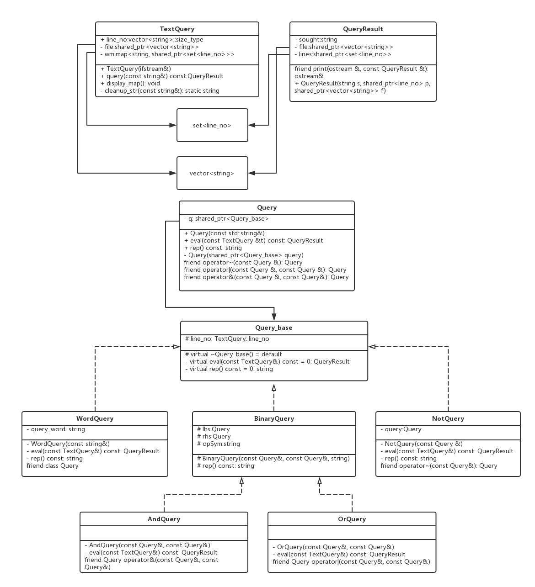
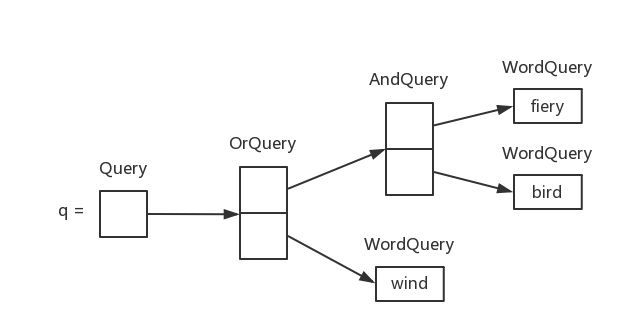
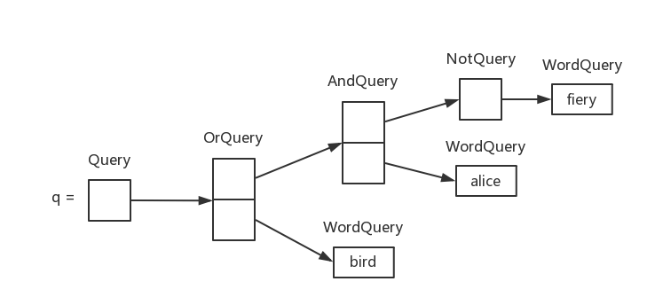

# TextQuery文本查询程序     

## 1. 类的继承体系      
```class
            Query_base
          /     |     \
         /      |      \
        /       |       \
    WordQuery NotQuery BinaryQuery
                        /       \
                       /         \
                      /           \
                    AndQuery    OrQuery
```

## 2. 具体设计
        

## 3. Query接口类       
Qeury_base类及其派生类用于完成具体的查询任务，但从用户使用的简单友好角度来说，需要向用户隐藏Query_base类的继承体系。设计名为Query的接口类来完成这项工作，其保存一个指向Query_base的智能指针，绑定到Query_base的派生类对象上。采用智能智能，可以动态管理Query_base类的内存。     

举几个例子，说明Query接口类简化设计的工作过程：     
1. `Query q = Query("firey") & Query("bird") | Query("wind")`
           
    Query中的shared_ptr<Query_base>指针q指向OrQuery的对象，OrQuery类中含有lhs,rhs两个Query成员变量，其智能指针q分别指向AndQuery对象和WordQuery对象。AndQuery类和OrQuery类似，都继承自BinaryQuery类，含有lhs,rhs两个Query成员变量，分别指向两个WordQuery对象。WordQuery类b不再含有Query成员变量，存储查找关键字，借助TextQuery对象，执行实际的查找工作。     

2. `Query q = ~Query("fiery") & Query("alice") | Query("bird")`     
         
    分析同上。      

## 4. 表达式解析        
对于类似于`~hair & alice | bird`这样的查询语句，必须能够转换为`~Query("hair") & Query("alice") | Query("bird")`的求值语句。而该表达式的解析，原理和算数表达式的解析一样，可以先转换为**逆波兰表达式（RPN）**，然后基于RPN进行表达式的求值，其过程如下：     
1. 转换为RPN        
    ```txt
    hair ~ alice & bird |
    ```     

2. 计算RPN      
    顺序扫描RPN，遇到`~`，`&`，`|`运算符即可完成对应计算，计算过程如下：        
    ```txt
    q = Query("hair")
        |
        q~
        |
       q = NotQuery("hair")
        |
       q Query("alice") &
        |
       q = AndQuery(q, "Alice")
        |
       q Query("bird") |
        |
       q = OrQuery(q, "bird")
    ```     

